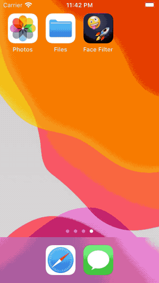

# Face Filter

A simple proof-of-concept prototype for iPhone to process an image and pixelate/blur the faces detected.

To do its job, the app relies on Apples "Vision" framework to detect faces in the image and then applies Core Image filters (Gaussian blur, square or hexagonal pixellate) onto them. If not all faces have been detected, a long-press gesture allows the user to quickly add one. 
For each face the filter can be adjusted. The resulting filtered image can then be shared.

## Features

- Import from photo library or directly from camera
- Automatic face detection using Vision framework
- Add a face manually using long-press gesture
- Filter configuration for each face
- Overview image showing "faces only"
- Share the resulting image directly from the app or store it in the photo library
- Basic photo editing extension integrated. (=does not yet provide all the configuration features)

## How to build

1. Install Xcode and open the project `FaceFilter.xcodeproj`

2. Choose a simulator and press "run"  
   (You will have to add images to the iOS Simulator using drag & drop, the camera is not available here.)

3. If you want to deploy the app to your device, you should checkout `Config.xcconfig` to see what settings need to be set. Especially the `DEVELOPMENT_TEAM` is required to sign the app for physical device deployment.  Afterwards you should select your device and press "run".

If you want to develop you can create a `LocalConfig.xcconfig` file to set `PRODUCT_BUNDLE_IDENTIFIER` and `DEVELOPMENT_TEAM` permanently to your chosen values.

## Demo

## Acknowledgement

- Original app idea by [Yannick Weiss](https://github.com/yene)
- Demo photo by [Naassom Azevedo on Unsplash](https://unsplash.com/photos/Q_Sei-TqSlc)